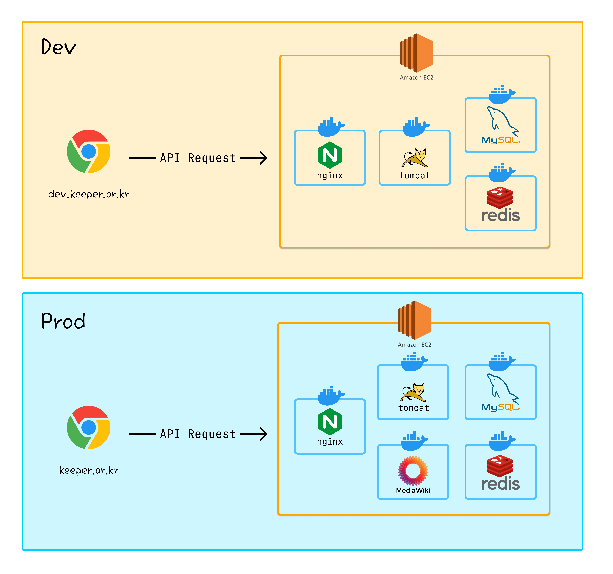
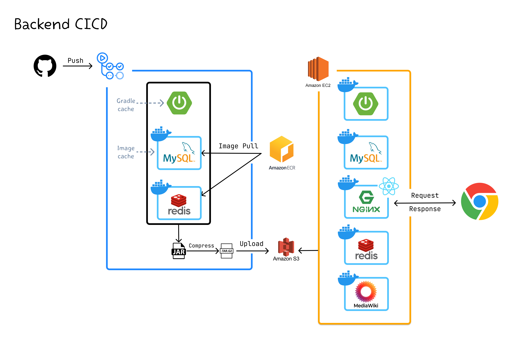

<div align="center">
   <br/>
</div>

# <div align="center">Homepage-Back-R2</div>

KEEPER 홈페이지 백엔드 서버입니다.

## ⭐️ 리뉴얼 프로젝트가 지향하는 바

- 언제나 후임자가 **유지보수하기 좋은 설계 방향**을 고민합니다.
- 캡슐화, 코드 재사용성, 테스트 용이성을 위해 비즈니스 로직을 도메인에 위치시킵니다.
- RESTful API 규칙에 따라 RESTful한 API를 설계하고자 합니다.
- 코드 컨벤션을 정하여 클린 코드를 작성합니다.
- 꼼꼼한 코드 리뷰를 통해 코드의 품질을 높이고, 서로의 작업물을 이해합니다.
- Controller, Service, Repoistory Layer에 대해 테스트 코드를 작성하여 사전에 버그를 방지합니다.

# 📝 링크

| 이름                   | 링크 |
|----------------------|---|
| 운영 홈페이지              | [https://keeper.or.kr](https://keeper.or.kr) |
| 개발 홈페이지              | [https://dev.keeper.or.kr](https://dev.keeper.or.kr) |
| API 문서               | [https://api.keeper.or.kr/docs/keeper.html](https://api.keeper.or.kr/docs/keeper.html) |
| Notion               | [https://chip-force-ed0.notion.site/KEEPER](https://chip-force-ed0.notion.site/KEEPER-0dbccc3c2374465b8be715cd9d872103?pvs=4) |
| 프론트 Repository       | [https://github.com/KEEPER31337/Homepage-Front-R2](https://github.com/KEEPER31337/Homepage-Front-R2) |
| 인프라 코드 Repository    | [https://github.com/KEEPER31337/Homepage-Infrastructure](https://github.com/KEEPER31337/Homepage-Infrastructure) |
| 데이터베이스 코드 Repository | [https://github.com/KEEPER31337/Homepage-Database](https://github.com/KEEPER31337/Homepage-Database) |

# ✨ 도메인

```
📦 domain
 ┣ 📂 about       // 메인 소개
 ┣ 📂 attendance  // 홈페이지 출석
 ┣ 📂 auth        // 로그인, 회원가입
 ┣ 📂 comment     // 댓글
 ┣ 📂 file        // 파일
 ┣ 📂 game        // 게임
 ┣ 📂 library     // 도서 대출, 관리
 ┣ 📂 member      // 회원 정보 관리
 ┣ 📂 merit       // 상벌점 부여, 관리
 ┣ 📂 point       // 포인트 부여, 관리
 ┣ 📂 post        // 게시글
 ┣ 📂 seminar     // 세미나 출석, 관리
 ┣ 📂 study       // 스터디
 ┗ 📂 thumbnail   // 썸네일
```

# 🛠️ 기술 스택

<div align="center">

**Language**


**Dependancy**


**Database**


**Tool**


</div>

# 🌐 인프라, CICD 구조

<div align="center">
  
  
</div>

# 🐬 ERD

<div align="center">
  
</div>

# ⚡️ 퀵 스타트

### STEP 1) 프로젝트 클론

```
git clone https://github.com/02ggang9/Keeper_start_guide.git
```

### STEP 2) .env 파일 생성

quick_start > build > .env 파일 생성 (env.example 파일 참고)

### STEP 3) mail 환경 변수 설정

quick_start > build > docker > data > application.yml 파일 이동 후 mail 환경 변수 설정

### STEP 4) 쉘 스크립트 실행

MAC 환경

```
sh ./run_keeper.sh
```

Ubuntu 환경

```
sudo ./run_keeper.sh
```

### STEP 5) 접속

```
localhost:8080
```

# 🧑🏻‍💻 코드 유지 관리자

<table>
  <tr>
    <td align="center">
      <a href="https://github.com/shkisme">
        
        <br/>
        <sub><b>shkisme</b></sub>
      </a>
      <br/>
    </td>
    <td align="center">
      <a href="https://github.com/02ggang9">
      
      <br />
      <sub><b>02ggang9</b></sub>
      </a>
      <br/>
    </td>
  </tr>
</table>

### 기여자

[](https://github.com/KEEPER31337/Homepage-Back-R2/graphs/contributors)

### 기여하기

[CONTRIBUTING.md](./CONTRIBUTING.md) 파일을 참고해주세요.
